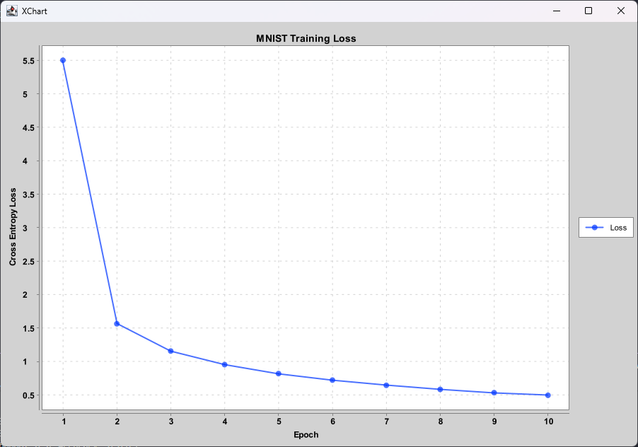
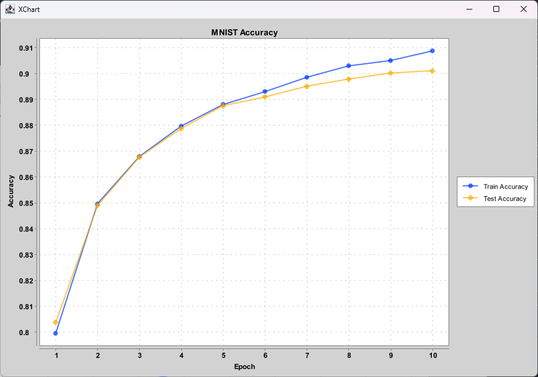
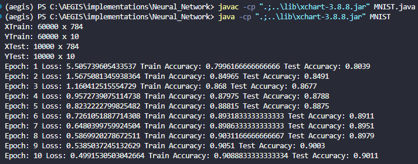
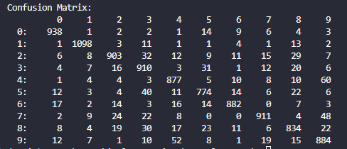

# AEGIS Neural Network

A lightweight, modular, from-scratch deep learning and neural network library implemented in pure Java (JDK 21+). Designed for educational clarity, modularity, and seamless integration as an independent Git submodule.

> [!NOTE]
>
> This is a **pure CPU, from-scratch Java implementation**. It does **not** rely on external tensor libraries (e.g. ND4J, Deeplearning4j, PyTorch, TensorFlow) and does **not** provide GPU support. All matrix algebra, forward passes, backward passes, activation functions, loss functions, and optimizers are custom-built.

---

## Architecture Overview

The library follows a clean, modular structure organized into distinct packages:

| Package           | Key Classes / Interfaces                             | Description                                                                                                                |
| :---------------- | :--------------------------------------------------- | :------------------------------------------------------------------------------------------------------------------------- |
| **`core`**        | `Matrix`, `NeuralNetwork`                            | Core 2D matrix engine with fundamental linear algebra operations and multi-layer feedforward neural network orchestrator.  |
| **`layers`**      | `Layer`, `Linear`                                    | Fully connected dense layers with forward propagation and analytical gradient backpropagation.                             |
| **`activations`** | `Activation`, `ReLU`, `Sigmoid`, `Softmax`           | Activation functions and their derivatives/Jacobians.                                                                      |
| **`losses`**      | `Loss`, `CrossEntropy`, `MSE`, `SoftmaxCrossEntropy` | Loss functions and analytical loss derivatives, including a numerically stable fused Softmax + CrossEntropy backward path. |
| **`optimizers`**  | `Optimizer`, `SGD`                                   | Parameter optimization algorithms (e.g. Stochastic Gradient Descent with configurable learning rate).                      |
| **`metrics`**     | `Metrics`                                            | Model evaluation utilities, including confusion matrix calculation and classification metrics.                             |
| **`models`**      | `Perceptron`, `LogisticRegression`                   | Classical machine learning algorithms implemented with the custom `Matrix` engine.                                         |
| **`exceptions`**  | `InvalidValue`                                       | Custom exception for matrix dimension mismatches, illegal indexing, and invalid numerical operations.                      |
| **`examples`**    | `MNIST`                                              | End-to-end classification pipeline for the MNIST handwritten digit dataset with real-time visualization.                   |

---

## Directory Structure

```text
Neural_Network/

├── assets/
│   ├── Confusion_Matrix_MNIST.png
│   ├── Training.png
│   ├── mnist_accuracy.png
│   └── mnist_loss.png
│
├── pom.xml
├── .gitignore
├── README.md
│
├── src/
│   ├── main/
│   │   └── java/
│   │       ├── core/
│   │       │   ├── Matrix.java
│   │       │   └── NeuralNetwork.java
│   │       ├── layers/
│   │       │   ├── Layer.java
│   │       │   └── Linear.java
│   │       ├── activations/
│   │       │   ├── Activation.java
│   │       │   ├── ReLU.java
│   │       │   ├── Sigmoid.java
│   │       │   └── Softmax.java
│   │       ├── losses/
│   │       │   ├── Loss.java
│   │       │   ├── CrossEntropy.java
│   │       │   ├── MSE.java
│   │       │   └── SoftmaxCrossEntropy.java
│   │       ├── optimizers/
│   │       │   ├── Optimizer.java
│   │       │   └── SGD.java
│   │       ├── metrics/
│   │       │   └── Metrics.java
│   │       ├── models/
│   │       │   ├── Perceptron.java
│   │       │   └── LogisticRegression.java
│   │       └── exceptions/
│   │           └── InvalidValue.java
│   │
│   └── test/
│       └── java/
│           ├── core/
│           │   ├── MatrixTest.java
│           │   ├── MatrixMatmulTest.java
│           │   ├── MatrixFullTest.java
│           │   └── ReproducibilityTest.java
│           ├── layers/
│           │   ├── LinearTest.java
│           │   └── LinearAliasingTest.java
│           ├── activations/
│           │   └── ActivationTest.java
│           ├── losses/
│           │   ├── LossTest.java
│           │   ├── SoftmaxCrossEntropyTest.java
│           │   └── ExplicitSoftmaxCrossEntropyTest.java
│           ├── optimizers/
│           │   └── SGDTest.java
│           ├── gradient/
│           │   ├── ComprehensiveGradientCheckTest.java
│           │   ├── EpsilonSweepTest.java
│           │   └── BatchGradientValidationTest.java
│           └── examples/
│               └── MNISTTest.java
│
└── examples/
    └── MNIST.java
```

---

## Dependencies

* **JDK**: Java 21 LTS or newer.
* **JUnit 5**: Used for automated unit, numerical validation, and regression testing.
* **XChart** (`org.knowm.xchart:xchart:3.8.8`): Used exclusively in `examples/MNIST.java` for plotting training loss curves, accuracy curves, and displaying charts via Swing. Managed via Maven Central.

---

## How to Build with Maven

To clean and compile the entire project:

```bash
mvn clean compile
```

To run the complete automated test suite:

```bash
mvn test
```

To package into a JAR:

```bash
mvn clean package
```

The test suite covers matrix operations, matrix multiplication, layer forward/backward passes, activation functions, losses, optimizers, numerical gradient validation, batch-gradient behavior, reproducibility, MNIST parsing, and regression tests for previously identified defects.

### Direct `javac` Compilation (Without Maven)

If Maven is not installed in your local environment, you can compile the project directly using JDK `javac`:

```powershell
# From the repository root (Neural_Network/):

mkdir -p target/classes

# Compile core library and examples (specifying external XChart jar)

javac -d target/classes -cp "..\lib\xchart-3.8.8.jar" (Get-ChildItem -Recurse -Filter "*.java" src/main/java).FullName examples/MNIST.java
```

---

## Running the MNIST Example

The MNIST example demonstrates training a multi-layer perceptron on the 70,000-image MNIST dataset from scratch.

### 1. Dataset Path

By default, the example looks for the raw MNIST IDX files (`train-images-idx3-ubyte`, `train-labels-idx1-ubyte`, `t10k-images-idx3-ubyte`, `t10k-labels-idx1-ubyte`) at:

```text
C:\AEGIS\roadmap\Deep_Learning\mnist\data\MNIST\raw
```

You can also pass a custom directory path as a command-line argument.

### 2. Run via Maven

```bash
mvn exec:java -Dexec.mainClass="examples.MNIST"
```

With a custom dataset path:

```bash
mvn exec:java -Dexec.mainClass="examples.MNIST" -Dexec.args="C:\path\to\MNIST\raw"
```

### 3. Run via Java CLI

```powershell
# Default path:

java -cp "target/classes;..\lib\xchart-3.8.8.jar" examples.MNIST

# Custom path:

java -cp "target/classes;..\lib\xchart-3.8.8.jar" examples.MNIST "C:\path\to\MNIST\raw"
```

---

## Current MNIST Benchmark

| Parameter                   | Value                                          |
| :-------------------------- | :--------------------------------------------- |
| **Architecture**            | `784` (Input) → `128` (Hidden) → `10` (Output) |
| **Hidden Activation**       | `ReLU`                                         |
| **Output Activation**       | `Softmax`                                      |
| **Loss Function**           | `CrossEntropy`                                 |
| **Optimizer**               | `SGD` (learning rate = `0.01`)                 |
| **Batch Size**              | `64`                                           |
| **Epochs**                  | `10`                                           |
| **Final Training Accuracy** | **~90.89%**                                    |
| **Final Test Accuracy**     | **~90.11%**                                    |

### Benchmark Visualizations

|              Training Loss Curve              |        Accuracy Curve (Train vs Test)        |
| :-------------------------------------------: | :------------------------------------------: |
|  |  |

|               Execution Logs               |                    Confusion Matrix                    |
| :----------------------------------------: | :----------------------------------------------------: |
|  |  |

### Pipeline Features

1. **Raw IDX Parsing**: Unsigned byte reading and pixel normalization (`[0, 255] → [0.0, 1.0]`).
2. **One-Hot Encoding**: Converts integer labels (`0-9`) into 10-dimensional unit vectors.
3. **Mini-Batch SGD**: In-place array index shuffling and batch slicing.
4. **Interactive Visualization**: Real-time XChart loss curve and train/test accuracy curve plots.
5. **Confusion Matrix**: Console-formatted 10x10 classification confusion matrix.
6. **Deterministic Training**: Seeded initialization and reproducibility validation.
7. **Numerical Gradient Validation**: Analytical gradients are verified against finite-difference numerical gradients.
8. **Regression Testing**: Core mathematical operations and previously identified implementation defects are covered by automated tests.

---

## Mathematical Validation

The implementation's analytical gradients are validated independently using central finite differences:

$$
\frac{\partial L}{\partial \theta} \approx \frac{L(\theta+\epsilon)-L(\theta-\epsilon)}{2\epsilon}
$$

Gradient checks cover:

* `Linear + MSE`
* `Linear + ReLU + MSE`
* `Linear + Sigmoid + MSE`
* `Linear + Softmax + CrossEntropy`
* Multiple random seeds
* Multiple batch sizes
* Different finite-difference step sizes

The validation suite confirms numerical agreement between analytical backpropagation and finite-difference gradients at floating-point precision levels. For the quadratic Linear + MSE case, errors reach approximately the `1e-12` range under suitable finite-difference step sizes; nonlinear cases are limited primarily by floating-point finite-difference error.

The repository also validates the fused Softmax + CrossEntropy derivative:

$$
\frac{\partial L}{\partial Z} = \frac{P-Y}{N}
$$

This avoids catastrophic gradient cancellation for highly confident incorrect predictions.

---

## Automated Testing

The project includes a JUnit 5 test suite covering the mathematical and software-engineering behavior of the implementation.

The current verification suite contains:

* Matrix construction and operations
* Matrix multiplication
* Matrix augmentation
* Matrix slicing and validation
* Linear forward and backward propagation
* ReLU, Sigmoid, and Softmax behavior
* MSE and CrossEntropy derivatives
* Fused Softmax + CrossEntropy gradients
* SGD parameter updates
* Batch-gradient normalization
* Deterministic seeded training
* Input/reference aliasing
* MNIST IDX parsing and normalization
* Comprehensive finite-difference gradient checking

All tests pass in the current verified state.

---

## Numerical Stability

Special attention is given to numerical stability in the Softmax + CrossEntropy pipeline.

A naive implementation can suffer from severe gradient cancellation when the model assigns an extremely small probability to the correct class. The implementation therefore provides a fused analytical backward path for Softmax + CrossEntropy using:

$$
\frac{\partial L}{\partial Z} = \frac{P-Y}{N}
$$

The standalone Softmax backward pass also uses a vector-Jacobian formulation rather than explicitly constructing the full Softmax Jacobian, reducing unnecessary computation.

---

## Performance

The matrix engine was optimized for the workload used by the MNIST benchmark.

For matrix multiplication of:

$$
A \in \mathbb{R}^{64\times784}
$$

and

$$
B \in \mathbb{R}^{784\times128}
$$

the multiplication implementation was changed from a column-extraction approach with repeated temporary allocations to a cache-friendly loop ordering.

The benchmark showed:

| Metric                              | Before Optimization | After Optimization |
| :---------------------------------- | :-----------------: | :----------------: |
| Temporary arrays per multiplication |        ~8,192       |          0         |
| 100 matrix multiplications          |     2,147.55 ms     |      132.62 ms     |
| Average multiplication time         |       21.48 ms      |       1.33 ms      |
| Improvement                         |          —          |  **~16.2× faster** |

The MNIST IDX loader was similarly changed from repeated byte-level reads to buffered block reads.

| Metric           |  Before Optimization  |  After Optimization  |
| :--------------- | :-------------------: | :------------------: |
| Loading strategy | Unbuffered byte reads | Buffered block reads |
| Full MNIST load  |      150+ seconds     |     ~0.59 seconds    |
| Improvement      |           —           |   **>250× faster**   |

These optimizations do not change the mathematical behavior of the network; they reduce allocation and I/O overhead in the Java implementation.

---

## Implementation Scope

This project intentionally focuses on understanding and implementing the fundamental components of neural networks rather than providing a production-ready deep learning framework.

The implementation currently supports:

* Dense/fully connected layers
* ReLU activation
* Sigmoid activation
* Softmax activation
* Mean Squared Error
* Cross Entropy
* Fused Softmax + CrossEntropy
* Mini-batch SGD
* Perceptron
* Logistic Regression
* Matrix-based forward propagation
* Analytical backpropagation
* Numerical gradient checking
* MNIST classification

The current implementation is CPU-only and uses a custom 2D `Matrix` representation rather than a general-purpose tensor engine.

---

## Known Limitations

The project is intentionally small and educational, and several areas remain open for future development:

1. **Weight Initialization**

   * Current initialization is basic seeded uniform initialization.
   * Xavier/Glorot and He/Kaiming initialization would be appropriate additions for deeper networks.

2. **Optimizer Support**

   * The current optimizer implementation provides vanilla SGD.
   * Momentum, RMSProp, and Adam could be added as additional implementations of the `Optimizer` abstraction.

3. **Model Abstraction**

   * `Perceptron` and `LogisticRegression` currently contain their own training logic rather than being unified with the neural-network training abstraction.

4. **Evaluation Mode**

   * The current network does not expose a dedicated training/evaluation mode distinction.

5. **Tensor Generality**

   * The implementation currently operates on 2D matrices and is not intended to replace a general-purpose tensor library.

These limitations are deliberate boundaries of the current implementation rather than claims of production-framework completeness.

---

## Project Goal

The goal of AEGIS Neural Network is not to compete with established deep learning frameworks.

The goal is to make the mechanics of neural networks explicit:

$$
XW^T+b \rightarrow \text{Activation} \rightarrow \text{Loss} \rightarrow \text{Backpropagation} \rightarrow \text{Parameter Update}
$$

Every major mathematical operation is implemented directly in Java, allowing the complete path from matrix multiplication to gradient descent to be inspected, tested, and validated.
